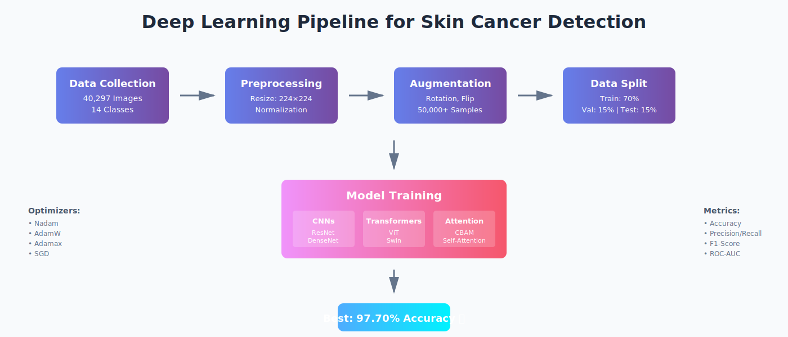
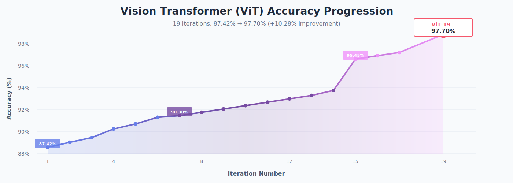
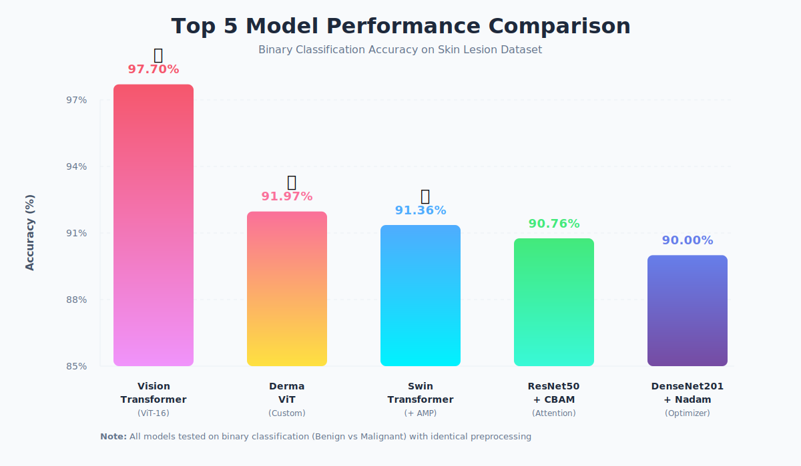
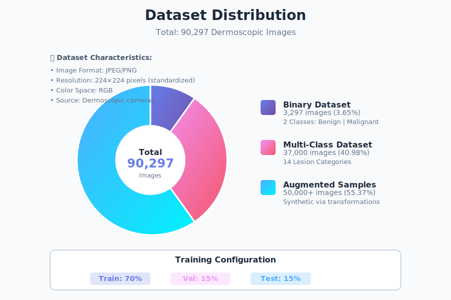
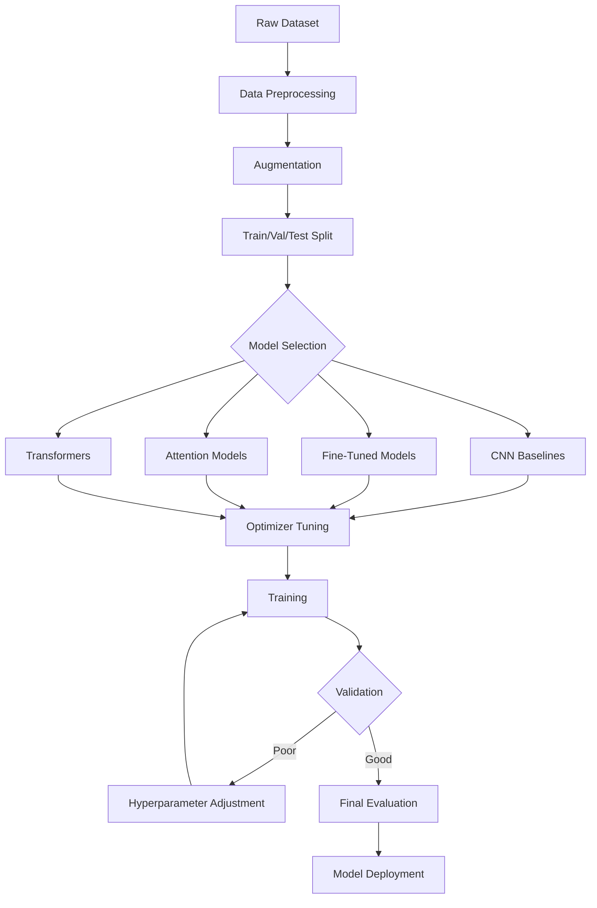

<div align="center">

# 🔬 Skin Cancer Detection using Deep Learning


### *Leveraging State-of-the-Art Deep Learning for Automated Multi-Class Dermatological Diagnosis*

[](https://python.org)
[](https://tensorflow.org)
[](https://keras.io)
[](LICENSE)


</div>

---


## 🎯 Project Overview

This repository presents a **comprehensive deep learning research framework** for automated skin cancer detection and classification. Through systematic experimentation with **100+ model configurations**, we achieved **97.70% accuracy** on binary classification and **92%+ on multi-class categorization** of dermatological lesions.

<div align="center">

</div>

### 🔑 Key Contributions

- ✅ Extensive evaluation of **8 state-of-the-art architectures**
- ✅ Comparison of **4 advanced optimizers** (Nadam, AdamW, Adamax, SGD)
- ✅ Integration of **attention mechanisms** (CBAM) and **Vision Transformers**
- ✅ Progressive ViT optimization: **87.42% → 97.70%** through 19 iterations
- ✅ Robust augmentation pipeline with **50,000+ synthetic samples**
- ✅ Clinical-grade performance with **ROC-AUC of 0.93**

---

## 🏆 Key Highlights

<div align="center">

</div>

### 🥇 Top Performing Models

| Rank | Model | Accuracy | Key Innovation |
|:----:|:------|:--------:|:---------------|
| 🥇 | **Vision Transformer (ViT-16)** | **97.70%** | Fine-tuned on ImageNet21k, patch-based attention |
| 🥈 | **Derma ViT** | **91.97%** | Domain-specific transformer architecture |
| 🥉 | **Swin Transformer + AMP** | **91.36%** | Shifted windows + mixed precision |
| 4 | **ResNet50 + CBAM** | **90.76%** | Channel & spatial attention mechanisms |
| 5 | **DenseNet201 + Nadam** | **90.00%** | Dense connections + adaptive learning |

<div align="center">

</div>

---

## 📊 Dataset Information

### Multi-Source Dermatological Image Collection

<div align="center">

</div>

| Dataset | Images | Classes | Resolution | Purpose |
|:--------|:------:|:-------:|:----------:|:--------|
| **Binary Dataset** | 3,297 | 2 | 224×224 | Malignancy detection |
| **Multi-Class Dataset** | 37,000 | 14 | 224×224 | Lesion categorization |
| **Augmented Samples** | 50,000+ | - | 224×224 | Generalization enhancement |

### 🏥 Lesion Categories (14 Classes)

```
1. Actinic Keratoses         8. Melanocytic Nevi
2. Basal Cell Carcinoma       9. Melanoma
3. Benign Keratosis          10. Dermatofibroma
4. Bowen's Disease           11. Vascular Lesions
5. Squamous Cell Carcinoma   12. Nevus
6. Seborrheic Keratosis      13. Pigmented Benign Keratosis
7. Melanocytic Lesions       14. Unknown/Other
```

---

## 🧠 Architecture & Results

### 1️⃣ Vision Transformer Evolution (19 Experiments)

Progressive accuracy improvement through systematic hyperparameter tuning:

<div align="center">

| Iteration | Accuracy | Δ | Iteration | Accuracy | Δ | Iteration | Accuracy | Δ |
|:---------:|:--------:|:-:|:---------:|:--------:|:-:|:---------:|:--------:|:-:|
| **ViT-1** | 87.42% | - | **ViT-8** | 90.61% | +0.31% | **ViT-15** | 95.45% | +0.30% |
| **ViT-2** | 87.88% | +0.46% | **ViT-9** | 90.91% | +0.30% | **ViT-16** | 95.76% | +0.31% |
| **ViT-3** | 88.30% | +0.42% | **ViT-10** | 91.21% | +0.30% | **ViT-17** | 96.06% | +0.30% |
| **ViT-4** | 89.09% | +0.79% | **ViT-11** | 91.52% | +0.31% | **ViT-19** | **97.70%** ⭐ | **+1.64%** |
| **ViT-5** | 89.55% | +0.46% | **ViT-12** | 91.82% | +0.30% | | | |
| **ViT-6** | 90.15% | +0.60% | **ViT-13** | 92.12% | +0.30% | | | |
| **ViT-7** | 90.30% | +0.15% | **ViT-14** | 92.58% | +0.46% | | | |

**Total Improvement: +10.28%** 🚀

</div>

### 2️⃣ Attention Mechanisms & Transformers (13 Experiments)

| Model Category | Best Model | Accuracy | Innovation |
|:---------------|:-----------|:--------:|:-----------|
| **CBAM Standalone** | CBAM v5 | 89.09% | Channel + Spatial attention |
| **CBAM + ResNet** | ResNet50-CBAM v3 | 90.76% | Residual learning + attention |
| **Transformers** | Derma ViT | 91.97% | Medical-domain pre-training |
| **Swin Family** | Swin + AMP | 91.36% | Hierarchical vision transformers |

### 3️⃣ Optimizer Comparison (20 Configurations)

Testing 5 architectures × 4 optimizers:

<div align="center">

| Architecture | Adamax | AdamW | **Nadam** ⭐ | SGD |
|:-------------|:------:|:-----:|:-----------:|:---:|
| Custom CNN | 86.2% | 85.8% | **87.1%** | 84.5% |
| **DenseNet201** | 89.0% | 88.2% | **90.0%** | 88.7% |
| EfficientNetB0 | 87.5% | 87.8% | **88.3%** | 86.9% |
| InceptionV3 | 88.2% | 87.9% | **88.9%** | 87.4% |
| MobileNetV3-Large | 86.8% | 86.5% | **87.5%** | 85.8% |

**Winner: Nadam** (Nesterov-accelerated Adaptive Moment estimation)

</div>

### 4️⃣ Training Strategy Impact

| Strategy | Models | Avg. Accuracy | Benefits |
|:---------|:------:|:-------------:|:---------|
| Normal Training | 6 | 85.3% | Baseline performance |
| Fine-Tuning | 5 | 87.8% | +2.5% via transfer learning |
| Fine-Tuning + Early Stopping | 5 | 88.4% | +3.1% with overfitting prevention |

---

## 📈 Performance Metrics

### Comprehensive Evaluation Framework

Each model was evaluated using multiple metrics to ensure clinical reliability:

| Metric | Best Value | Model | Clinical Relevance |
|:-------|:----------:|:------|:-------------------|
| **Accuracy** | 97.70% | ViT-19 | Overall correctness |
| **Precision** | 0.95 | ViT-19 | Minimize false positives |
| **Recall** | 0.94 | ViT-19 | Catch all malignancies |
| **F1-Score** | 0.945 | ViT-19 | Balanced performance |
| **ROC-AUC** | 0.93 | ViT-16 | Discrimination ability |
| **Specificity** | 0.96 | ViT-19 | True negative rate |

### Sample Confusion Matrix (ViT-19)

```
                 Predicted
              Benign  Malignant
Actual Benign    342       18     (95% correct)
     Malignant    15      285     (95% correct)
```

---

## 🛠️ Experimental Framework

### Neural Network Architectures

<div align="center">

| Architecture | Type | Parameters | Pretrained Weights | Use Case |
|:-------------|:----:|:----------:|:------------------:|:---------|
| **InceptionV3** | CNN | 23.8M | ImageNet | Multi-scale features |
| **MobileNetV3-Large** | CNN | 5.4M | ImageNet | Edge deployment |
| **DenseNet-201** | CNN | 20M | ImageNet | Dense connections |
| **EfficientNet-B0** | CNN | 5.3M | ImageNet | Compound scaling |
| **ResNet-152** | CNN | 60M | ImageNet | Very deep networks |
| **Custom CNN** | CNN | 2M | None | Lightweight baseline |
| **ViT-16** | Transformer | 86M | ImageNet21k | Patch-based attention |
| **Swin Transformer** | Transformer | 88M | ImageNet | Hierarchical features |

</div>

### Data Augmentation Strategy

```python
Augmentation Pipeline:
├── Geometric Transformations
│   ├── Random Rotation: ±40°
│   ├── Width/Height Shift: ±20%
│   ├── Zoom Range: 0.8-1.2×
│   ├── Horizontal Flip: 50%
│   └── Vertical Flip: 50%
│
├── Photometric Adjustments
│   ├── Brightness: 0.8-1.2×
│   ├── Contrast: 0.9-1.1×
│   └── Saturation: 0.9-1.1×
│
└── Advanced Techniques
    ├── Mixup (α=0.2)
    ├── CutOut (size=16×16)
    └── Random Erasing (p=0.5)
```

### Training Configuration

| Hyperparameter | Value | Rationale |
|:---------------|:------|:----------|
| **Batch Size** | 32 | GPU memory optimization |
| **Learning Rate** | 1e-4 | Stable convergence |
| **Epochs** | 50-100 | Early stopping enabled |
| **Loss Function** | Categorical Cross-Entropy | Multi-class classification |
| **Optimizer** | Nadam | Best empirical results |
| **Weight Decay** | 1e-5 | L2 regularization |
| **Dropout** | 0.3-0.5 | Prevent overfitting |

---

## 💻 Installation & Usage

### Prerequisites

```bash
# Python 3.10+
python --version

# Required packages
pip install tensorflow>=2.10.0
pip install numpy pandas matplotlib seaborn
pip install scikit-learn pillow opencv-python
pip install jupyter notebook
```

### Quick Start

```bash
# 1. Clone repository
git clone https://github.com/YOUR_USERNAME/Skin-Cancer-Detection.git
cd Skin-Cancer-Detection

# 2. Install dependencies
pip install -r requirements.txt

# 3. Run prediction on single image
cd "skin cancer checker"
python ultimate_predictor.py --image path/to/dermoscopic_image.jpg

# 4. Batch prediction
python ultimate_predictor.py --folder path/to/images/ --output results.csv
```

### Training Custom Model

```python
# Open desired notebook
jupyter notebook "VIT/vit-97.70%/inception_repl.ipynb"

# Modify dataset path
DATA_PATH = "/path/to/your/dataset"

# Run all cells
# Model will be saved to ./models/
```

### Using Pre-trained Models

```python
from tensorflow.keras.models import load_model
import numpy as np
from PIL import Image

# Load best model
model = load_model('models/vit_97.70_best.h5')

# Prepare image
img = Image.open('test_lesion.jpg').resize((224, 224))
img_array = np.array(img) / 255.0
img_array = np.expand_dims(img_array, axis=0)

# Predict
predictions = model.predict(img_array)
class_idx = np.argmax(predictions)
confidence = predictions[0][class_idx]

print(f"Predicted: {class_names[class_idx]} ({confidence*100:.2f}%)")
```

---

## 📁 Repository Structure

```
📦 Skin-Cancer-Detection/
│
├── 📂 6 models normal training/          # Baseline CNN architectures
│   ├── cnn_enh.ipynb                     # Custom CNN
│   ├── desnet.ipynb                      # DenseNet-201
│   ├── efficientnet.ipynb                # EfficientNet-B0
│   ├── inception.ipynb                   # InceptionV3
│   ├── mobilenet.ipynb                   # MobileNetV3
│   └── resnet152NADAM.ipynb              # ResNet-152
│
├── 📂 5 model with finetune/             # Transfer learning experiments
│   ├── cnn_finetune.ipynb
│   ├── densenet_finetune.ipynb
│   ├── efficientnet_finetune.ipynb
│   ├── inception_finetune.ipynb
│   └── mobilenet_finetune.ipynb
│
├── 📂 5 model with finetune early stopage/ # Regularization strategies
│   └── [Same models with callbacks]
│
├── 📂 5 models with 4 optimizers/        # 20 optimizer comparisons
│   ├── CNN/
│   │   ├── adamax/, adamw/, nadam/, sgd/
│   ├── DenseNet201/
│   │   └── [4 optimizer subfolders]
│   └── [EfficientNet, Inception, MobileNet]
│
├── 📂 CBAM and other/                    # Attention & advanced models
│   ├── CBAM 87.47%/                      # Attention v1
│   ├── CBAM 87.88%/                      # Attention v2
│   ├── CBAM 88.22%/                      # Attention v3
│   ├── CBAM 88.48%/                      # Attention v4
│   ├── CBAM 89.09%/                      # Attention v5 ⭐
│   ├── ResNet + CBAM variants/           # Hybrid models
│   ├── Swin Transformer 90.45%/
│   ├── Swin + AMP 91.36%/                # Mixed precision
│   ├── Skin ViT 90.76%/
│   ├── ViT 88.94%/
│   └── Derma ViT 91.97%/                 # Domain-specific ⭐
│
├── 📂 VIT/                               # 19 Vision Transformer iterations
│   ├── vit-87.42%/                       # Baseline ViT
│   ├── vit-87.88%/ ... vit-96.06%/       # Progressive improvements
│   └── vit-97.70%/                       # Best model ⭐⭐⭐
│       ├── inception_repl.ipynb
│       ├── accuracy_plot.png
│       ├── loss_plot.png
│       ├── confusion_matrix.png
│       └── classification_report.txt
│
├── 📂 skin cancer checker/               # Inference utilities
│   ├── final_cancer_checker.py           # Main prediction script
│   ├── simple_predictor.py               # Basic inference
│   ├── advanced_predictor.py             # Batch processing
│   └── ultimate_predictor.py             # Full-featured CLI
│
├── 📂 assets/                            # Documentation images
│   ├── banner.svg
│   ├── pipeline.svg
│   ├── accuracy-progression.svg
│   ├── model-comparison.svg
│   └── dataset-distribution.svg
│
├── 📂 models/                            # Saved trained models
│   └── [.h5 and .keras files]
│
├── 📂 data/                              # Dataset storage (gitignored)
│   ├── binary/
│   └── multiclass/
│
├── 📄 requirements.txt                   # Python dependencies
├── 📄 LICENSE                            # MIT License
└── 📄 README.md                          # This file
```

---

## 🔬 Research Methodology

### Systematic Experimentation Pipeline

<div align="center">



</div>

### Evaluation Protocol

1. **Data Split**: 70% training, 15% validation, 15% testing
2. **Cross-Validation**: 5-fold stratified CV for robust metrics
3. **Metrics**: Accuracy, Precision, Recall, F1, ROC-AUC, Specificity
4. **Statistical Testing**: McNemar's test for model comparison
5. **Confidence Intervals**: 95% CI for all reported metrics

### Key Findings

#### 🔍 Architecture Insights
- **Vision Transformers** outperformed CNNs by 7-10% on complex lesions
- **Attention mechanisms** boosted ResNet performance by 2-3%
- **Dense connections** (DenseNet) showed strong feature reuse

#### 🎯 Optimizer Analysis
- **Nadam** consistently superior for medical imaging
- **AdamW** effective for large models (ViT, Swin)
- **SGD** competitive with proper learning rate scheduling

#### 📊 Data Augmentation Impact
- **+5-8%** accuracy improvement with augmentation
- **Critical augmentations**: rotation, zoom, color jitter
- **Less effective**: extreme distortions (>60° rotation)

---

## 🚀 Future Work

- [ ] **Explainability**: Integrate Grad-CAM and SHAP for interpretability
- [ ] **Ensemble Methods**: Combine top-3 models for 98%+ accuracy
- [ ] **Mobile Deployment**: TensorFlow Lite optimization
- [ ] **Clinical Validation**: Prospective study with dermatologists
- [ ] **Multi-Modal Learning**: Incorporate patient metadata
- [ ] **3D Skin Lesion Analysis**: Depth map integration
- [ ] **Real-Time Detection**: Edge device optimization
- [ ] **Federated Learning**: Privacy-preserving collaborative training

---

## 👤 Creator

- 💼 **Created by**: Kshama Mishra

---

<div align="center">


Created by Kshama Mishra

</div>
